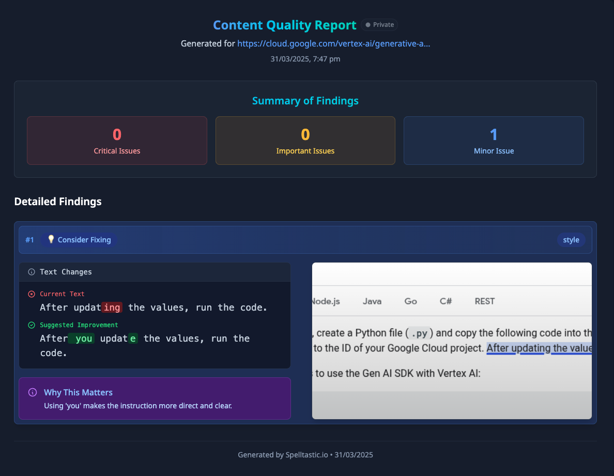
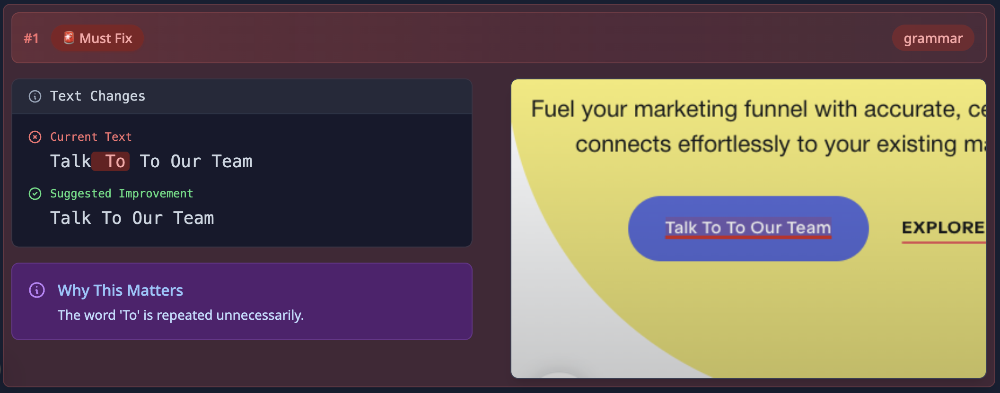
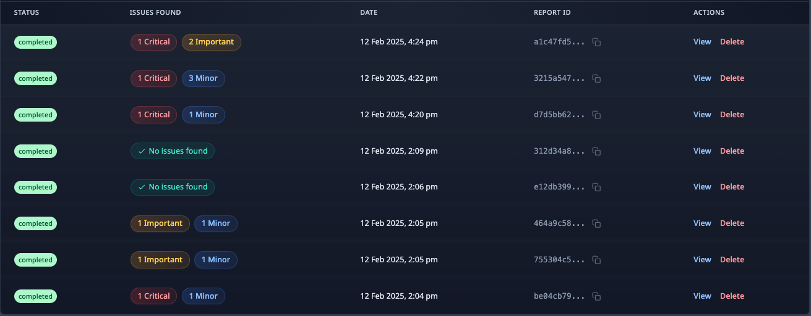

<div align="center">
  
</div>

<div align="center">

Catch Easy To Miss Typos, Grammatical Issues, and More on your website...

[](https://opensource.org/licenses/MIT)

[Try Spelltastic Cloud](https://spelltastic.io) • [Report a bug](https://github.com/yourusername/spelltastic/issues) • [Request a feature](https://github.com/yourusername/spelltastic/issues)

</div>

> This is the open-source core version of [spelltastic.io](https://spelltastic.io). For a fully managed service with additional features, visit our cloud platform.

## ✨ Features

- **Visual Reports**: Get detailed reports for your entire web page, with visual highlights and screenshots, and categorised by severity
<div align="center">
  
</div>

- **AI-Powered Analysis + Suggestions**: See where the issues are on the page and why they are there, and how to fix them
<div align="center">
  
  <p><em>The text 'To' is repeated twice on the button</em></p>
</div>

- **Centralised Dashboard**: Visualize and manage your content quality checks
<div align="center">
  
</div>

- **Multiple Language Support**: Check content in various languages. Spanish, French, German, Italian, Portuguese, Dutch, and more.

## 💫 Core vs Cloud

| Feature                             | Core | Cloud          |
| ----------------------------------- | ---- | -------------- |
| Issue Categorisation                | ✅   | ✅             |
| Dashboard                           | ✅   | ✅             |
| AI-Powered Analysis                 | ✅   | ✅             |
| Visual Reports                      | ✅   | ✅             |
| Multiple Language Support           | ✅   | ✅             |
| Create User Accounts                | ❌   | ✅             |
| Page Monitoring                     | ❌   | ✨ Coming soon |
| Private/Public Reports              | ❌   | ✅             |
| Rapid Scanning via Chrome Extension | ❌   | ✅             |
| Managed Infrastructure              | ❌   | ✅             |
| Priority Support                    | ❌   | ✅             |

## 🚀 Getting Started

### Prerequisites

- Node.js 22 or higher
- OpenAI API Key
- Docker (optional)

### Quick Start with Docker

```bash
# Clone the repository
git clone https://github.com/pulkitsharma07/spelltastic-core.git
cd spelltastic-core

# Build and run with Docker
docker build -t spelltastic .
docker run -p 3000:3000 -e OPENAI_API_KEY=your_api_key_here spelltastic
```

### Manual Installation / Development Setup

```bash
# Clone the repository
git clone https://github.com/pulkitsharma07/spelltastic-core.git
cd spelltastic-core

# Install dependencies
npm install

# Set up environment variables
cp .env.example .env.local
# Edit .env.local with your OPENAI_API_KEY

# Run database migrations
npx drizzle-kit push

# Start the development server
npm run dev
```

## 🔧 Configuration

Create a `.env.local` file with the following variables:

```env
OPENAI_API_KEY=your_openai_api_key
```

## 🛠️ Built With

- [Cursor](https://cursor.sh/) - AI-powered coding assistant
- [Next.js](https://nextjs.org/) - React framework for production
- [Drizzle ORM](https://orm.drizzle.team/) - TypeScript ORM
- [Tailwind CSS](https://tailwindcss.com/) - Utility-first CSS framework
- [Puppeteer](https://pptr.dev/) - Headless Chrome automation
- [Redis](https://redis.io/) - In-memory data structure store, used as a cache

## 🏗️ Architecture

The core system is built with:

- **Frontend**: Next.js for the web interface
- **Database**: SQLite for persistent storage
- **Cache**: Redis for caching prompts, DOM snapshots, etc.
- **Browser Automation**: Puppeteer for web page analysis, injecting JavaScript into the page, screenshots.

## 🔍 How It Works

1. **Page Loading**: Uses Puppeteer to load and render the target website
2. **Content Extraction**: Extracts text content from the rendered page
3. **Analysis Workflow**:
   (Check out [src/app/api/create-run/route.ts](src/app/api/create-run/route.ts) for the full workflow)
   - Initial LLM pass to identify potential spelling errors
   - Basic heuristics to filter out false positives
   - Secondary LLM verification for remaining issues
   - Visual highlighting by injecting JavaScript into the page (using Puppeteer)
   - Screenshot capture of affected elements (using Puppeteer)
4. **Database Storage**:
   - Stores the report in the database
   - Allows you to view the report in the dashboard
   - Checkout schema [here](src/db/schema.ts).

## 📝 License

This project is licensed under the MIT License - see the [LICENSE](LICENSE) file for details.

## 🤝 Contributing

Contributions are welcome! Please feel free to submit a Pull Request. For major changes, please open an issue first to discuss what you would like to change.

1. Fork the repository
2. Create your feature branch (`git checkout -b feature/AmazingFeature`)
3. Commit your changes (`git commit -m 'Add some AmazingFeature'`)
4. Push to the branch (`git push origin feature/AmazingFeature`)
5. Open a Pull Request
